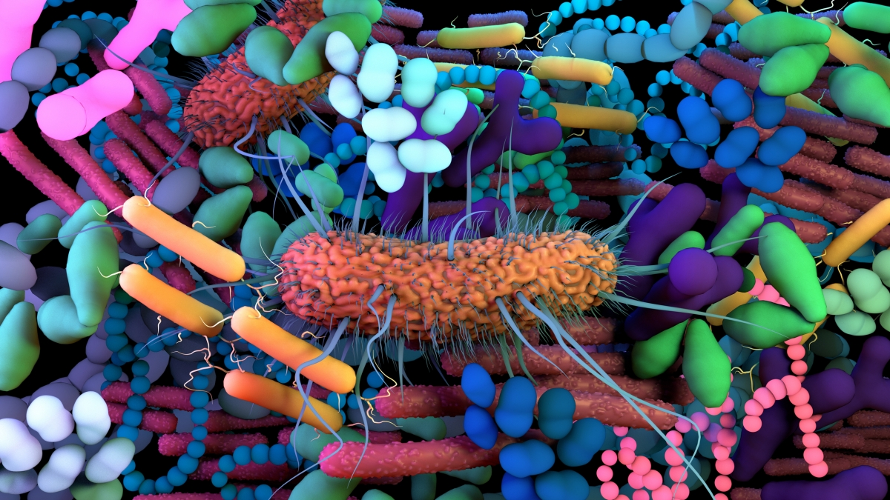
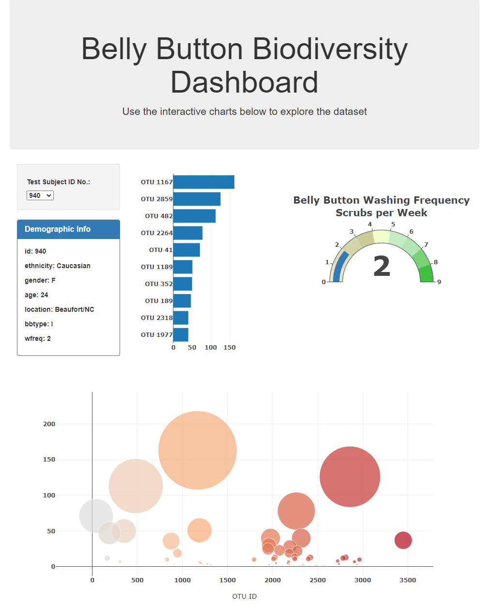

# Interactive Visualisations Dashboard

 

### View Dashboard
[Belly Button Biodiversity Dashboard](https://abzraja.github.io/interactive-web-visualisations/)
 

 

### Contents
* [Summary](#summary)
* [Dataset](#dataset)
* [Libraries](#libraries)
* [Dashboard](#dashboard)
 

### Summary
* [Belly button biodiversity dataset](#dataset) was used to present on an interactive Dashboard. The dashboard was built using [bootstrap](#bootstrap) for responsiveness.
* Data was imported into JavaScript using [D3.js](#d3) JSON.
* [D3](#d3) was also used to append the selection box with the Subject ID values from the Belly Button JSON Data and then update the Plots based on the Subject ID selected.
* [Plotly](#plotly) Javascript library was used to create interactive plots.
 

### Dataset
* [Belly Button Biodiversity](http://robdunnlab.com/projects/belly-button-biodiversity/)

The dataset reveals that a small handful of microbial species (also called operational taxonomic units, or OTUs, in the study) were present in more than 70% of people, while the rest were relatively rare.
 

### Libraries
* [Bootstrap](https://getbootstrap.com/docs/3.4/getting-started/)
* [D3](https://d3js.org/)
* [Plotly Javascript](https://plotly.com/javascript/)
 

### View Dashboard

The final output can be viewed here: [Belly Button Biodiversity Dashboard](https://abzraja.github.io/interactive-web-visualisations/)

 
 

 

### Abz Raja
abzraja@gmail.com